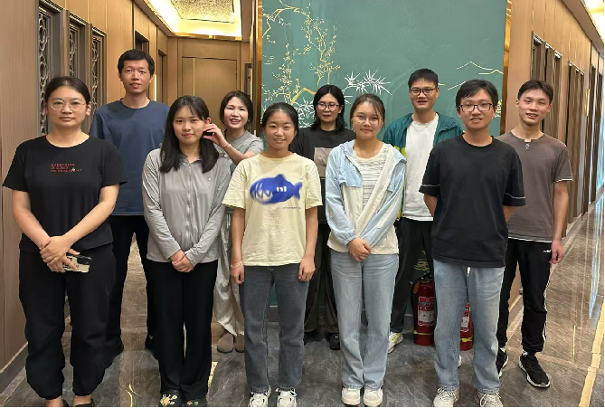

# 吴坤伟课题组（徐州医科大学）

---

## 🧪 研究方向

- 精神疾病发病机制及麻醉治疗  
- 麻醉调控生理功能机制  

---

## 👥 团队成员

### 🧑‍🔬 课题组负责人
- **姓名**: 吴坤伟
- **职称**: 教授 
- **邮箱**: kunwei.wu@xzhmu.edu.cn
- **个人主页**: [https://orcid.org/0000-0003-4074-0567](https://orcid.org/0000-0003-4074-0567)

---

### 🎓 研究生
- 王行何、叶嘉乐、郑爱秋、龚淑敏、孟欣、俞丹、赵祥合  

---

### 🎓 本科生
- 贾肖、俞智阳、汤灿、周慧  

  
---
  

    
    
2024.10

  

---

## 📢 最新动态

- **[日期]**: [简要描述最新研究成果、项目进展或实验室新闻]。  
- **[日期]**: [简要描述另一项重要动态]。
  
---

## 📚 发表论文

1.	Wang G, Peng S, Mendez MR , Keramidas A, Castellano D, **Wu KW**, Han W, Tian Q, Dong L, Li Y and Lu W. The TMEM132B-GABAA receptor complex controls alcohol actions in the brain. *Cell*. 2024.
2.	Pandey S, Han W, Li J, Shepard R, **Wu KW**, Castellano D, Tian Q, Dong L, Li Y, Lu W. Reversing anxiety by targeting a stress-responsive signaling pathway. *PNAS*. 2024.
3.	**Wu KW#**, Gong S, Chu XP: Crosstalk within neurovascular unit: endothelial implications for the development and function of brain. *Frontiers in Cellular Neuroscience*. 2024. (#corresponding author)
4.	**Wu KW#**, Lu W: GABAergic synaptic transmission and plasticity oscillate across sleep and wake. *Neural Regeneration Research* 2023. (#corresponding author)
5.	Castellano D, **Wu KW**, Keramidas A, Lu W: Shisa7-dependent control of GABAA receptor single channel gating kinetics. *Journal of Neuroscience* 2022. 
6.	**Wu KW**, Han W, Lu W: Sleep and wake cycles dynamically modulate hippocampal inhibitory synaptic plasticity. *PLOS biology* 2022. 
7.	**Wu KW#**, Shepard DR#, Castellano D, Han W, Tian Q, Dong L, Lu W: Shisa7 phosphorylation regulates GABAergic transmission and neurodevelopmental behaviors. *Neuropsychopharmacology* 2022. (#co-first author)
8.	**Wu KW**, Castellano D, Tian Q, Lu W: Distinct regulation of tonic GABAergic inhibition by NMDA receptor subtypes. *Cell reports* 2021. 
9.	**Wu KW**, Han W, Tian Q, Li Y, Lu W: Activity- and sleep-dependent regulation of tonic inhibition by Shisa7. *Cell reports* 2021.
10.	Nguyen TA, **Wu KW**, Pandey S, Lehr AW, Li Y, Bemben MA et al: A Cluster of Autism-Associated Variants on X-Linked NLGN4X Functionally Resemble NLGN4Y. *Neuron* 2020. 
11.	Mota Vieira M, Nguyen TA, **Wu KW** et al: An Epilepsy-Associated GRIN2A Rare Variant Disrupts CaMKIIalpha Phosphorylation of GluN2A and NMDA Receptor Trafficking. *Cell reports* 2020. 
12.	**Wu KW**, Lv LL, Lei Y, Qian C, Sun FY: Endothelial cells promote excitatory synaptogenesis and improve ischemia-induced motor deficits in neonatal mice. *Neurobiology of Disease* 2019. 
13.	Li J, Han W, **Wu KW**, Li YD, Liu Q, Lu W: A Conserved Tyrosine Residue in Slitrk3 Carboxyl-Terminus Is Critical for GABAergic Synapse Development. *Frontiers in Molecular Neuroscience*. 2019. 
14.	Han W, Li J, Pelkey KA, Pandey S, Chen X, Wang YX, **Wu KW**, Ge L, Li T, Castellano D et al: Shisa7 is a GABAA receptor auxiliary subunit controlling benzodiazepine actions. *Science* 2019.
15.	Kou ZW, Mo JL, **Wu KW**, Qiu MH, Huang YL et al: Vascular endothelial growth factor increases the function of calcium-impermeable AMPA receptor GluA2 subunit in astrocytes via activation of protein kinase C signaling pathway. *Glia*. 2019. 
16.	Mo JL, Liu Q, Kou ZW, **Wu KW**, Yang P, Chen XH, Sun FY: MicroRNA-365 modulates astrocyte conversion into neuron in adult rat brain after stroke by targeting Pax6. *Glia*. 2018. 
17.	**Wu KW**, Mo JL, Kou ZW, Liu Q, Lv LL, Lei Y, Sun FY: Neurovascular Interaction Promotes the Morphological and Functional Maturation of Cortical Neurons. *Frontiers in Cellular Neuroscience* 2017. 
18.	**Wu KW**, Kou ZW, Mo JL, Deng XX, Sun FY: Neurovascular coupling protects neurons against hypoxic injury via inhibition of potassium currents by generation of nitric oxide in direct neuron and endothelium cocultures. *Neuroscience* 2016. 
19.	**Wu KW**, Yang P, Li SS, Liu CW, Sun FY: VEGF attenuated increase of outward delayed-rectifier potassium currents in hippocampal neurons induced by focal ischemia via PI3-K pathway. *Neuroscience* 2015. 
20.	Jing Y#, **Wu KW#**, Liu J#, Ai Q, Ge P, Dai J et al: Aminotriazole alleviates acetaminophen poisoning via downregulating P450 2E1 and suppressing inflammation. *PLOS One* 2015. (#co-first author) 
21.	Deng X#, **Wu KW#**, Wan J#, Li L, Jiang R, Jia M, Jing Y, Zhang L: Aminotriazole attenuated carbon tetrachloride-induced oxidative liver injury in mice. *Food Chem Toxicol* 2012. (#co-first author)
22.	Yang P, Sun X, Kou ZW, **Wu KW**, Huang YL, Sun FY: VEGF Axonal Transport Dependent on Kinesin-1B and Microtubules Dynamics. *Frontiers in Molecular Neuroscience*. 2017. 
23.	Dai J, Liu M, Ai Q, Lin L, **Wu KW**, Deng X et al: Involvement of catalase in the protective benefits of metformin in mice with oxidative liver injury. *Chemico-Biological Interactions* 2014. 

---

## 🤝 科研项目

- 国家自然科学基金青年项目，2025.01-2027.12
- 江苏省高校自然科学研究重大项目，2024.10-2027.10
- 江苏省特聘教授项目（特别资助），2023.10-2026.10
- 徐州医科大学青年创新团队项目，2024.10-2027.10
- 徐州医科大学启动经费项目，2022.10-2027.10 

---

## 🚀 加入我们

课题组招收研究生/科研助理/博士后/讲师，欢迎广大优秀人才的加入！
---

## 📬 联系我们

- **地址**: 徐州市云龙区铜山路医科大学科教楼D401 
- **邮箱**: kunwei.wu@xzhmu.edu.cn 
- **电话**: 0516-83262690 

